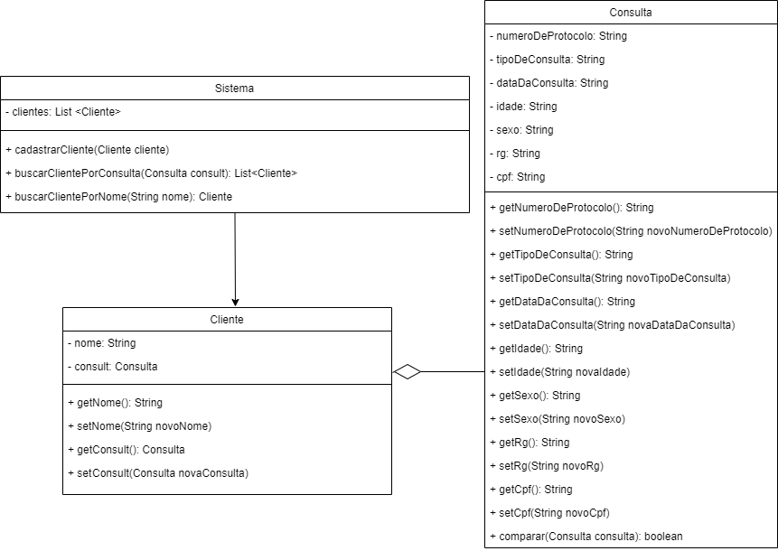
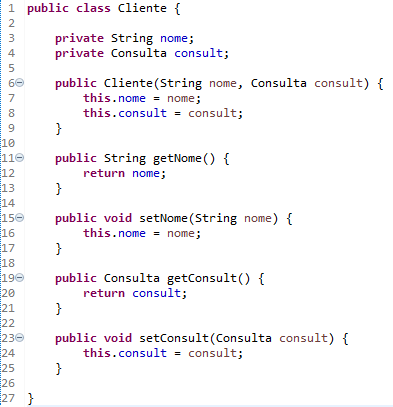
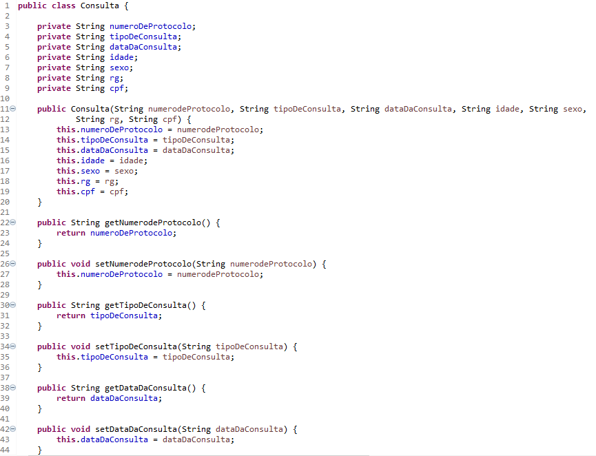
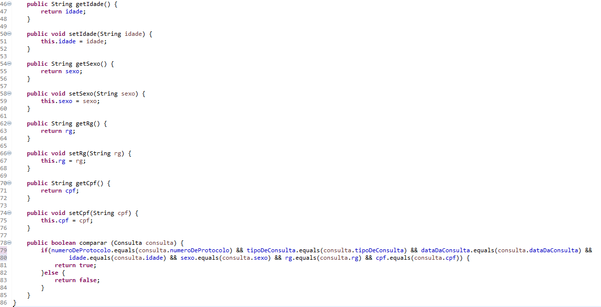
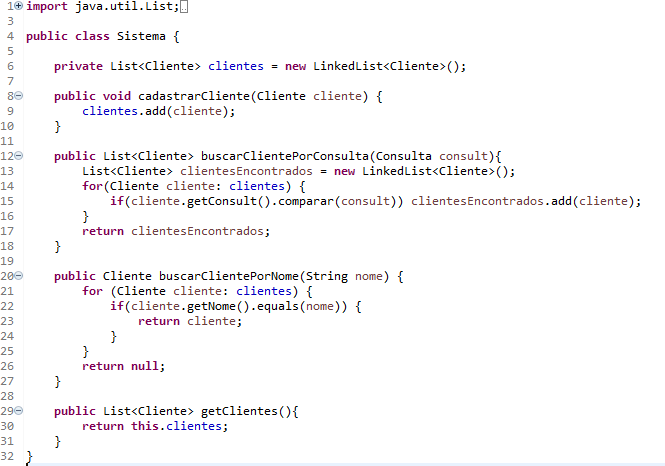
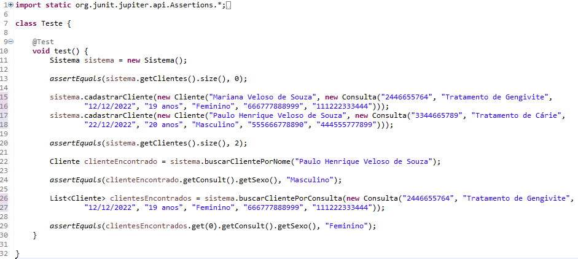

<h2> Texto do Engenheiro </h2>

"We see three critical differences between 
programming and software engineering: time, 
scale, and the trade-offs at play. On a 
software engineering project, engineers need 
to be more concerned with the passage of time 
and the eventual need for change. In a software 
engineering organization, we need to be more 
concerned about scale and efficiency, both for 
the software we produce as well as for the 
organization that is producing it. Finally, 
as software engineers, we are asked to make 
more complex decisions with higher-stakes 
outcomes, often based on imprecise estimates 
of time and growth. Within Google, we sometimes 
say, “Software engineering is programming 
integrated over time.” Programming is certainly 
a significant part of software engineering: after
all, programming is how you generate new software
in the first place. If you accept this 
distinction, it also becomes clear that we might 
need to delineate between programming tasks 
(development) and software engineering tasks 
(development, modification, maintenance). The 
addition of time adds an important new dimension 
to programming. Cubes aren’t squares, distance 
isn’t velocity. Software engineering isn’t 
programming." 

Titus Winters, Software Engineering at Google

<h4>Comentário:</h4> Do meu ponto de vista a 
programação é uma matéria essencial para 
diversos cursos, principalmente para engenharia,
independente da área de atuação do engenheiro, pois,
ela serve para aprimorar suas habilidades, entre
elas desenvolver soluções lógicas para problemas, 
podendo até substituir atividades manuais,
o que torna essas tarefas mais práticas, como a
realização de cálculos.A Engenharia de Software 
em si tem como objetivo moldar indivíduos não
somente para aprender linguagens de programação,
mas usá-las de base para desenvolvimentos futuros,
ou seja, capacita as pessoas com a utilização de 
ferramentas, a ciência por trás das técnicas, para
então poderem chegar a um objetivo predeterminado,
visando sempre o progresso, algo que possa
influenciar no futuro.

<h2> Trade Off - API </h2>

Trade Off nada mais é do que se encontrar em uma
situação que se deve escolher entre ideias,
analisando com cuidado cada uma delas para então
chegar em um consenso de qual se encaixa melhor
no contexto. Com base no desenvolvimento do API o
que se encaixaria dentro da ideia de Trade Off 
seriam os métodos a serem utilizados no 
desenvolvimento do projeto, ou seja, selecionar
uma plataforma que seja mais adequada para o
desenvolvimento de uma atividade. Por exemplo no
desenvolvimento do backlog analisamos o melhor
aplicativo para criar ele, entre o Canva e o Figma,
selecionamos o Canva, por ser mais rápido e fácil
de manusear, portanto analisamos a situação que 
traria mais vantagens e desvantagens no momento e 
chegamos a uma decisão.

<h2> Atividade de Requisito - Ciclo de Vida do Desenvolvimento de Software </h2>

<h4>Situação:</h4> Uma empresa de odontologia necessita
de um sistema para o Cadastro de Clientes, onde ela poderá
encontrá-lo por seu Nome ou pelos atributos contidos 
na Consulta, além de poder comparar dados entre consultas.
 
<h4>Requisitos Funcionais:</h4>

- Cadastramento de Clientes: esse tópico aborda o 
cadastramento do cliente, onde teremos dados, como Nome
e Consulta;
- Cadastramento de Consultas: tópico no qual deve-se
passar dados para uma consulta, como Número do Protocolo, 
Tipo de Consulta, Data da Consulta, Idade, Sexo, RG e CPF;

<h4>Diagrama de Casos de Uso:</h4>

<h4>Requisitos Não Funcionais:</h4>

- Usabilidade;
- Transparência;
- Plataforma Intuitiva e Flexível;

<h4>Diagrama de Classes UML:</h4>

<h2> Prints do Código </h2>

<h4>Classe Cliente:</h4> 

<h4>Classe Consulta:</h4>

<h4>Classe Sistema:</h4>

<h4>Classe Teste:</h4>

