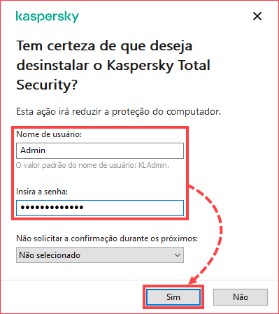
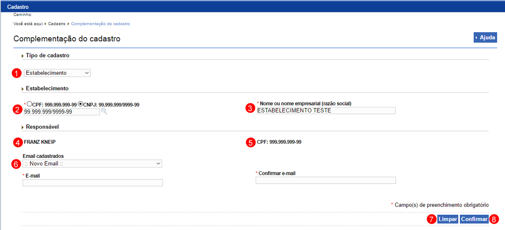
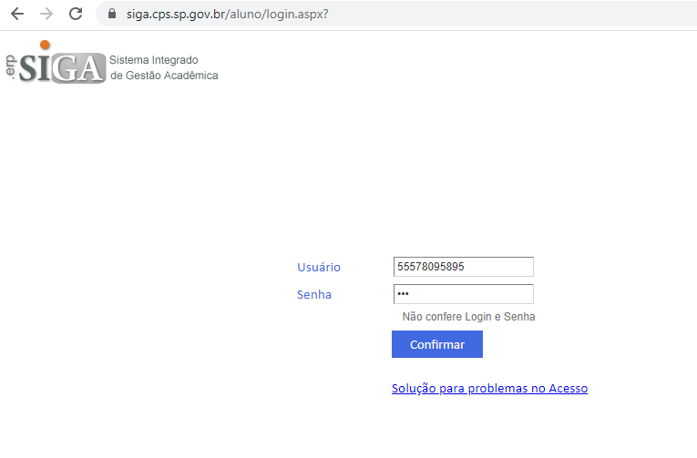
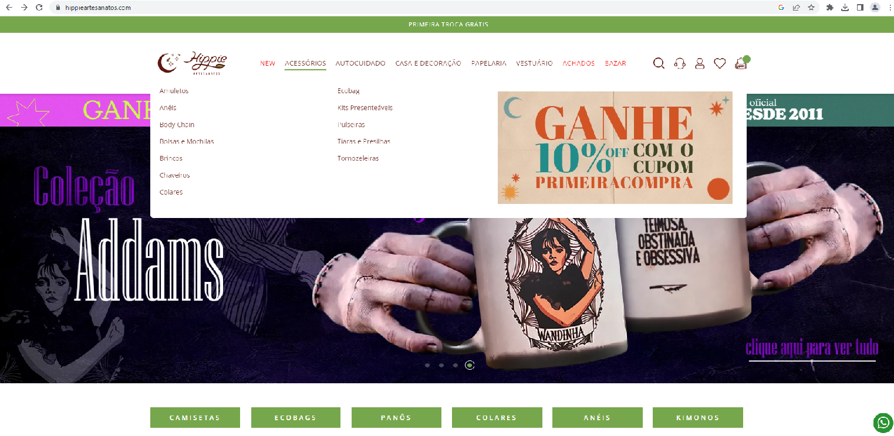
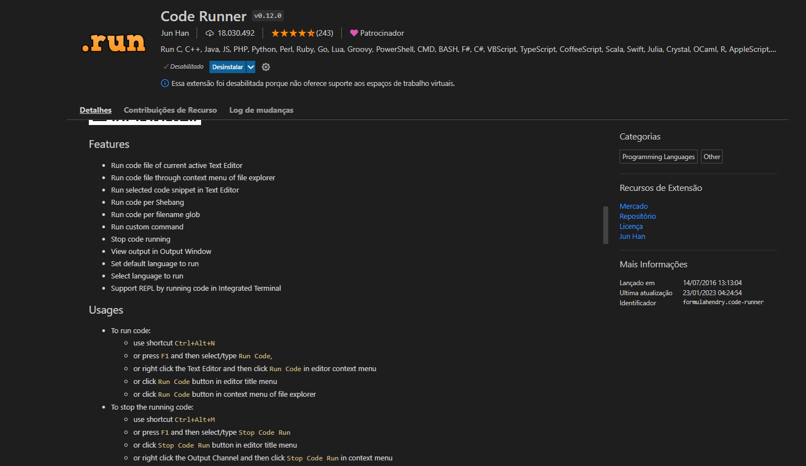
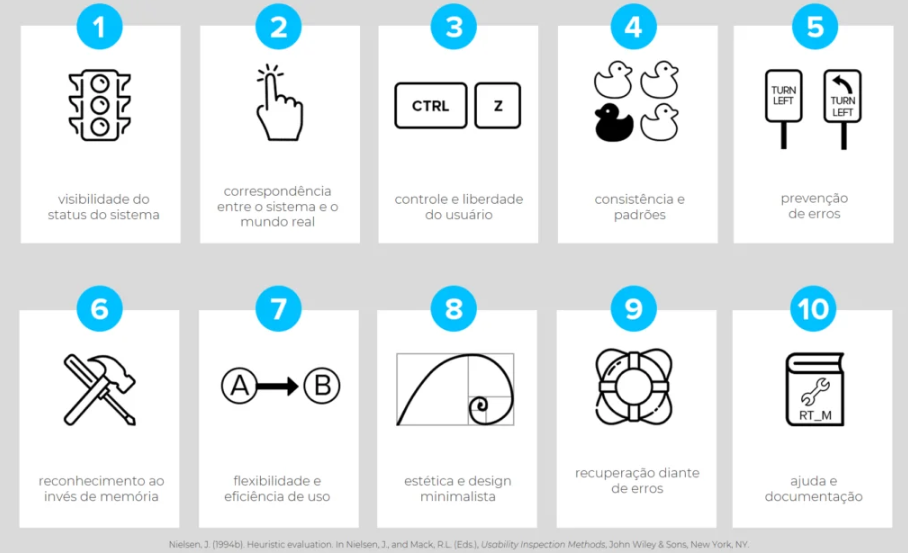

<h2> Avaliação Heuristica GUI </h2>

<h3> Heurística 01 - Visibilidade do Status: </h3> 
 

<h3> Heurística 02 - Correspondência entre o sistema e o mundo real: </h3> 
 

<h3> Heurística 03 - Controle e liberdade do usuário: </h3> 
 

<h3> Heurística 04 - Consistência e padrões: </h3> 
 
 

<h3> Heurística 05 - Prevenção de erros: </h3> 
 

<h3> Heurística 06 - Reconhecimento ao invés de memória: </h3> 
 

<h3> Heurística 07 - Flexibilidade e eficiência de uso: </h3> 
 

<h3> Heurística 08 - Estética e design minimalista: </h3> 
 

<h3> Heurística 09 - Recuperação diante de erros: </h3> 
 

<h3> Heurística 10 - Ajuda e documentação: </h3> 
 
