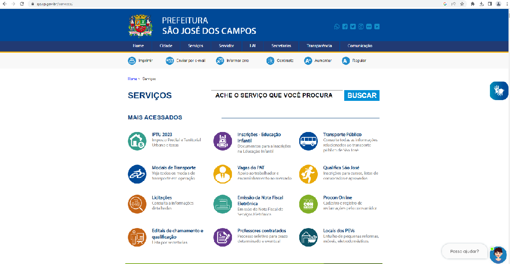

<h2> Avaliação Heuristica GUI </h2>

<h3> Heurística 01 : Visibilidade de qual estado estamos no sistema</h3> 
<h4> Imagem 01</h4> 
 
<h4> Imagem 02</h4> 
 
É responsabilidade do sistema informar o que está acontecendo em tempo real para o usuário. A "Imagem 01" representa um antivírus quando está sendo desinstalado e as instruções dele deixa bem claro que tal ação não será benéfica para o sistema. Já a "Imagem 2" representa essa heurística sendo aplicada corretamente quando estamos assistindo uma playlist do Youtube, do lado direito fica bem claro: qual vídeo estamos assistindo, qual é o próximo e quais já foram assistidos ou não. 

<h3> Heuristica 02: Correspondência entre o sistema e o mundo real </h3> 
<h4> Imagem 01</h4> 
 
<h4> Imagem 02</h4> 
 
Em relação ao mundo real considera-se: sons, visual e o tom de escrita que usuário utiliza para se comunicar. Implementamos bastante esta heurística quando utilizamos uma seta, ícones e utilizamos a cor vermelha para elementos negativos. Na página da Prefeitura de São José dos Campos para facilitar a interação do usuário com a plataforma utiliza-se símbolos para representar os serviços, o que deixa mais prático para ele encontrar o serviço desejado, é possível observar na "Imagem 01". Um software que usa essa heurística é o Photoshop em sua barra de ferramentas, é possível analisar na "Imagem 02"> 

<h3> Heurística 03: Liberdade de controle fácil pro usuário</h3> 
<h4> Imagem 01</h4> 
 
<h4> Imagem 02</h4> 
 
Nesta heurística, a preocupação é passar para o usuário a liberdade de ele fazer o que quiser dentro do sistema com exceção das regras que vão contra o negócio ou interferem em outra funcionalidade. Na "Imagem 01" o usuário tem autonomia para limpar os campos do formulário que ele deseja e escolher as opções mais adequadas a ele. Já no exemplo da "Imagem 02", quando criamos um tweet podemos deletá-lo, mas não dá pra editar um tweet. Imagina a situação em que uma pessoa da um retweet e depois o usuário que fez o tweet muda o texto pra uma coisa que você não compactua. 

<h3> Heurística 04: Consistência e padrões</h3> 
<h4> Imagem 01</h4> 
 
<h4> Imagem 02</h4> 
 
<h4> Imagem 02</h4> 
 
É importante manter a consistência e padrão visual (texto, cor, desenho do elemento, som e etc). Na página do Mercado Livre e da Shopee, "Imagem 01" e "Imagem 02" respectivamente, temos um padrão de páginas de vendas de produtos, onde temos a consistência do padrão visual, onde encontramos em ambos, o carrinho de compras localizado na parte superior direita e a cor de ambos os sites mantem um padrão. Outro exemplo, no fórum GUJ(Grupo de usuários Java), quando vamos responder um post, o botão para enviar a resposta sempre é da mesma cor, tamanho e texto. O elemento para cancelar a resposta sempre tem seus padrões, podemos observar isso na "Imagem 03".

<h3> Heurística 05: Prevenções de erros</h3> 
<h4> Imagem 01</h4> 
 
<h4> Imagem 02</h4> 
 

<h3> Heurística 06: Reconhecimento em vez de memorização</h3> 
<h4> Imagem 01</h4> 
 
<h4> Imagem 02</h4> 
 

<h3> Heurística 07: Flexibilidade e eficiência de uso</h3> 
<h4> Imagem 01</h4> 
 
<h4> Imagem 02</h4> 
 

<h3> Heurística 08: Estética e design minimalista</h3> 
<h4> Imagem 01</h4> 
 
<h4> Imagem 02</h4> 
 

<h3> Heurística 09: Ajude os usuários a reconhecerem, diagnosticarem e recuperarem-se de erros</h3> 
<h4> Imagem 01</h4> 
 

<h3> Heurística 10: Ajuda e documentação</h3> 
<h4> Imagem 01</h4> 
 
<h4> Imagem 02</h4> 
 
