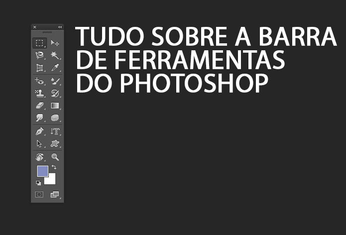

<h2> Avaliação Heuristica GUI </h2>

<h3> Heurística 01 : Visibilidade de qual estado estamos no sistema</h3> 
 
 

<h3> Imagem 02: </h3> 
 
 

<h3> Imagem 03: </h3> 
 
 

<h3> Imagem 04: </h3> 
 
 
 

<h3> Imagem 05: </h3> 
 
 
 

<h3> Imagem 06: </h3> 
 
 

<h3> Imagem 07: </h3> 
 
 

<h3> Imagem 08: </h3> 
 
 

<h3> Imagem 09: </h3> 
 
 
